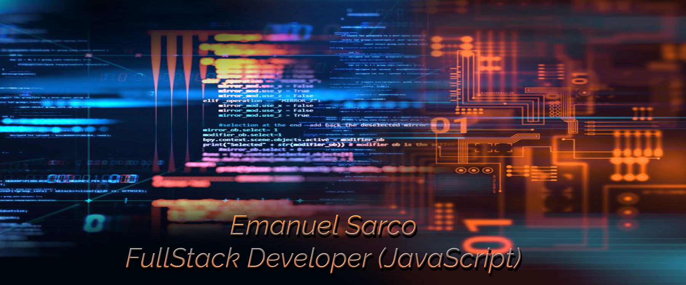

### Hola 👋
Soy Emanuel Sarco, desarrollador web.\
Soy estudiante universitario de la carrera de Licenciatura en Sistemas en la UNGS\
Actualmente estoy terminando un bootcamp full stack en Henry
https://www.soyhenry.com/

### Me gusta aprender tecnologías nuevas
Las tecnologias que conozco son: \
SQL |
Java |
PHP |
HTML5 |
JavaScript |
CSS |
React.js |
AJAX |
JSON |
Node.js |
LESS |
SASS |
Bootstrap |
PostgreSQL |
jQuery |
Git |
GitHub |
Express.js |
Axios |
Redux |
Interfaz de programación de aplicaciones (API) |
Web Services API |

### Me gusta trabajar en equipo y poder aprender de mis compañeros

### Me pueden contactar
Por email: emasar91@gmail.com

<!--
**emasar91/emasar91** is a ✨ _special_ ✨ repository because its `README.md` (this file) appears on your GitHub profile.

Here are some ideas to get you started:

- 🔭 I’m currently working on ...
- 🌱 I’m currently learning ...
- 👯 I’m looking to collaborate on ...
- 🤔 I’m looking for help with ...
- 💬 Ask me about ...
- 📫 How to reach me: ...
- 😄 Pronouns: ...
- ⚡ Fun fact: ...
-->
